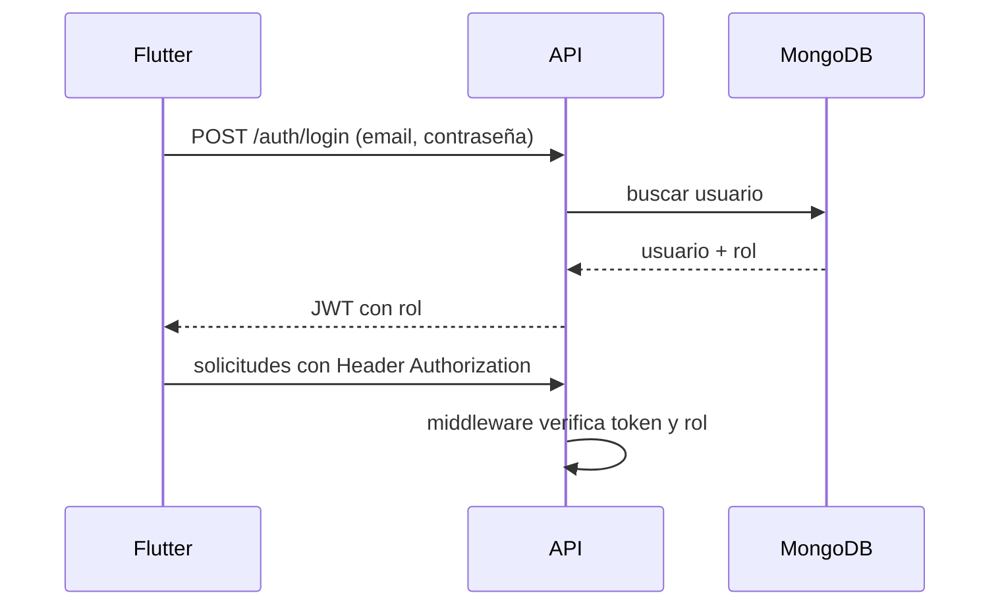
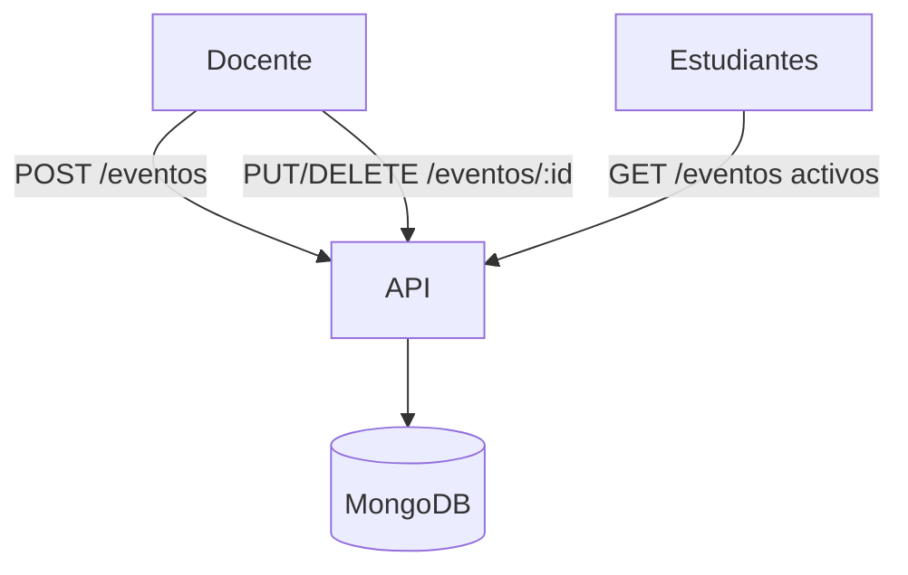
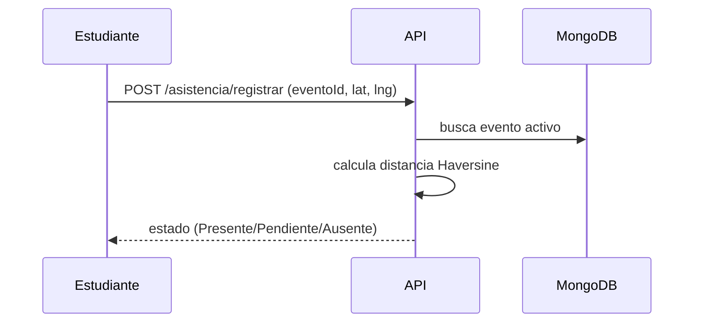
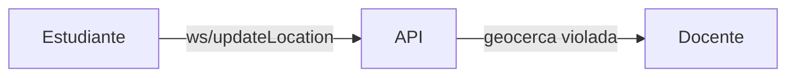

# GeoAsist Backend

GeoAsist es una plataforma móvil y web para el control de asistencia basada en geolocalización. El proyecto combina un **frontend Flutter** y un **backend Node.js + Express** con base de datos **MongoDB**, organizados bajo principios de _Clean Architecture_.

---
## 1. Descripción general
- Los **docentes** crean eventos y definen la geocerca válida.
- Los **estudiantes** registran su asistencia desde la aplicación móvil cuando se encuentran dentro del área.
- El sistema notifica al docente si un estudiante abandona la zona permitida y genera métricas y reportes.

```mermaid
flowchart LR
    A[Flutter App] -- REST/WS --> B[API Node.js]
    B --> C[(MongoDB)]
    B <--> D[Servicios Externos\n(PDF, Email)]
```

---
## 2. Tecnologías usadas
- **Flutter 3**: aplicación móvil multiplataforma.
- **Node.js 18 + Express**: servidor REST.
- **MongoDB** con **Mongoose**.
- **JWT** y **bcrypt** para autenticación.
- **WebSockets (ws)** para ubicación en tiempo real.
- **node-cron** para tareas programadas.
- **Swagger** para documentación interactiva.
- **PM2** para despliegue.

---
## 3. Estructura del proyecto
### Backend (este repositorio)
```
src/
  config/        # Conexión, logger y WebSocket
  controllers/   # Lógica de negocio
  cron/          # Tareas programadas
  middlewares/   # Autenticación y validaciones
  models/        # Esquemas de Mongoose
  routes/        # Endpoints REST
  utils/         # Funciones auxiliares
app.js           # Punto de entrada
```

### Frontend (Flutter)
```
lib/
  src/
    presentation/   # Widgets y rutas
    domain/         # Casos de uso y entidades
    data/           # Clientes REST y repositorios
```

---
## 4. Configuración y despliegue
1. Clonar el repositorio y crear un archivo `.env` basado en `.env.example`.
2. Instalar dependencias del backend:
   ```bash
   npm install
   npm start
   ```
3. En el proyecto Flutter, configurar el `baseUrl` apuntando al servidor y ejecutar:
   ```bash
   flutter run
   ```
4. Para producción se recomienda usar **PM2**:
   ```bash
   pm2 start ecosystem.config.js
   ```

---
## 5. Flujos principales
### 5.1 Autenticación y control de roles

- Roles disponibles: **docente** y **estudiante**. Los middlewares restringen el acceso a rutas protegidas.

### 5.2 Creación y actualización de eventos con geolocalización

- Cada evento almacena coordenadas y radio permitido. El docente puede modificarlas en cualquier momento.

### 5.3 Registro y validación de asistencia


1. La app obtiene la geolocalización del estudiante.
2. El estudiante envía `POST /asistencia/registrar` con el `eventoId` y sus coordenadas.
3. La API verifica que el evento exista, esté activo y que el estudiante no haya registrado antes.
4. Se calcula la distancia respecto a la geocerca del evento:
   - **Presente**: dentro del radio permitido.
   - **Pendiente**: fuera del radio pero antes de 10 minutos del inicio.
   - **Ausente**: fuera del radio y pasado el tiempo de gracia.
5. Se guarda la asistencia con las coordenadas y el estado resultante.
6. Un cron job (`src/cron/asistenciaCron.js`) corre cada minuto y cambia de "Pendiente" a "Ausente" las asistencias con más de 10 minutos.

- El front verifica la posición usando `geolocator` antes de enviar la solicitud.

### 5.4 Notificaciones por salida de área

- Mediante WebSockets el servidor recibe la posición en tiempo real. Si el estudiante sale del polígono se emite un evento al dashboard del docente.

### 5.5 Dashboards y reportes
- **Docente**: métricas de asistencia por evento, gráficos y descarga de PDF.
- **Estudiante**: historial de participaciones y estado de justificativos.

---
## 6. Ejemplos de endpoints
```bash
# Registro
POST /usuarios {"nombre":"Ana","email":"ana@uni.edu","password":"123"}

# Login
POST /auth/login {"email":"ana@uni.edu","password":"123"}

# Crear evento (docente)
POST /eventos {"nombre":"Clase","lat":-12.0,"lng":-77.0,"radio":50}

# Actualizar ubicación (estudiante)
POST /location {"lat":-12.0,"lng":-77.1}

# Registrar asistencia
POST /asistencias {"eventoId":1,"lat":-12.0,"lng":-77.0}
```

---
## 7. Buenas prácticas, pruebas y recomendaciones
- Usar TypeScript o JSDoc para tipos claros.
- Validar entradas con bibliotecas como `joi` o `express-validator`.
- Registrar errores con `winston` y monitorear con PM2.
- Implementar pruebas unitarias y de integración (por ejemplo con **Jest** y **supertest**).
- Automatizar _linting_ y _formatting_ en CI/CD.
- Mantener variables sensibles en `.env` y rotar claves JWT periódicamente.

Para ejecutar pruebas (pendientes de implementación):
```bash
npm test
```

---
## 8. Recomendaciones de despliegue
- MongoDB administrado (Atlas) para alta disponibilidad.
- HTTPS obligatorio y renovación de tokens.
- Monitorizar métricas con dashboards como Grafana.
- Realizar respaldos periódicos de la base de datos.

---
## 9. Créditos
Proyecto desarrollado por el equipo de GeoAsist.

